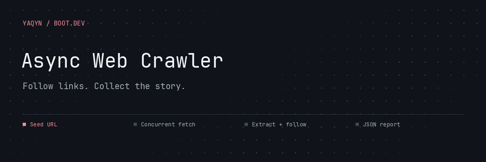
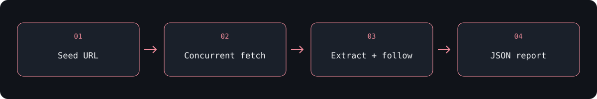
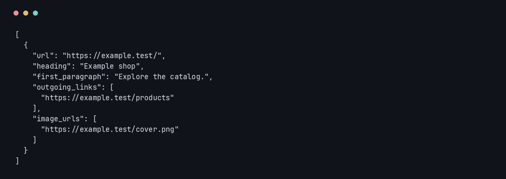

# Async Web Crawler

**Collect a website’s headings, links, and images into a structured JSON report.**

Start with a URL and follow links on the same network location. Async requests share a concurrency limit while visited-page tracking prevents duplicate work. The crawler extracts page data and writes it in URL order to `report.json`.

##  Start a crawl

Requires **Python 3.13+** and **uv**.

```bash
uv sync
uv run main.py https://learnwebscraping.dev/practice/ecommerce/ 3 20
```

```text
uv run main.py BASE_URL [MAX_CONCURRENCY] [MAX_PAGES]
```

Defaults are **5 concurrent fetches** and **100 pages**. Use positive integers. The command prints the seed page’s HTML, reports crawl progress, and writes `report.json` in the current directory.

##  Follow the links, keep the structure



| Report field | Content |
| --- | --- |
| `url` | Page URL |
| `heading` | First `h1`, falling back to `h2` |
| `first_paragraph` | First paragraph in `main`, or in the page if `main` is absent |
| `outgoing_links` | Links resolved against the page URL |
| `image_urls` | Image sources resolved against the page URL |



<sub>Local demonstration fixture; no live website data.</sub>

##  Explore the implementation

| File | Responsibility |
| --- | --- |
| `main.py` | CLI, shared session, concurrency, task tracking, and crawl limit |
| `crawl.py` | URL normalization and Beautiful Soup extraction |
| `json_report.py` | Sorted, indented JSON output |
| `test_crawl.py` | Extraction and crawl behavior tests |

The crawler processes HTML responses without rendering JavaScript. Visit identity uses the network location and path, ignoring query strings and trailing slashes. Outgoing links can appear in the report even when their destinations are outside the crawl scope. There is no robots.txt policy or request-rate delay in the current implementation; choose appropriate sites and limits.

##  Verify the crawler

```bash
uv run python -m unittest -v
```

This project explores async tasks, semaphores, shared state, cancellation, HTML parsing, and structured output.

---

Built by **[Abdulrahman M. Yaqyn](https://yaqyn.dev)** through the [Boot.dev](https://www.boot.dev) curriculum.
